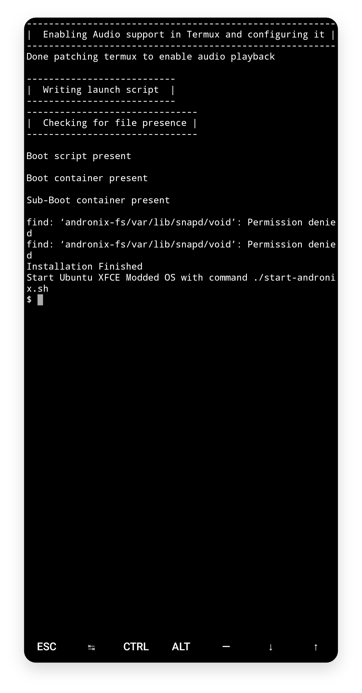
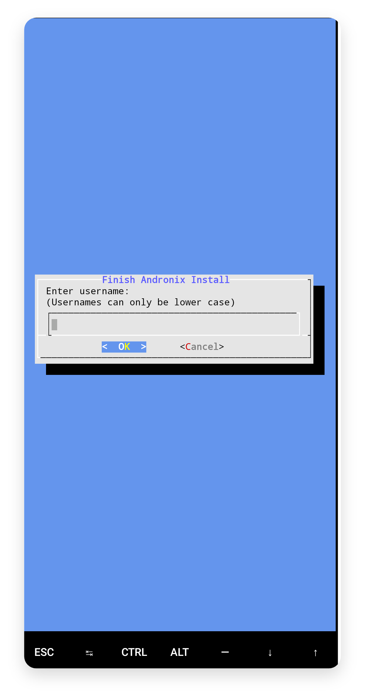
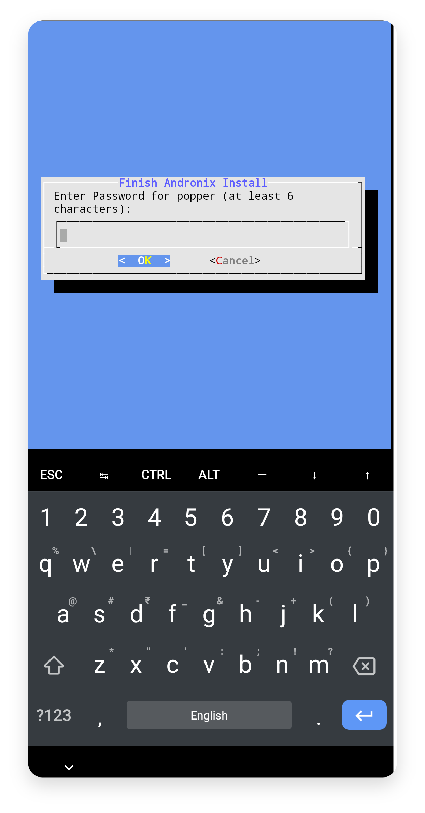
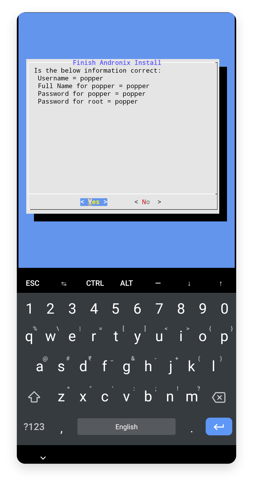
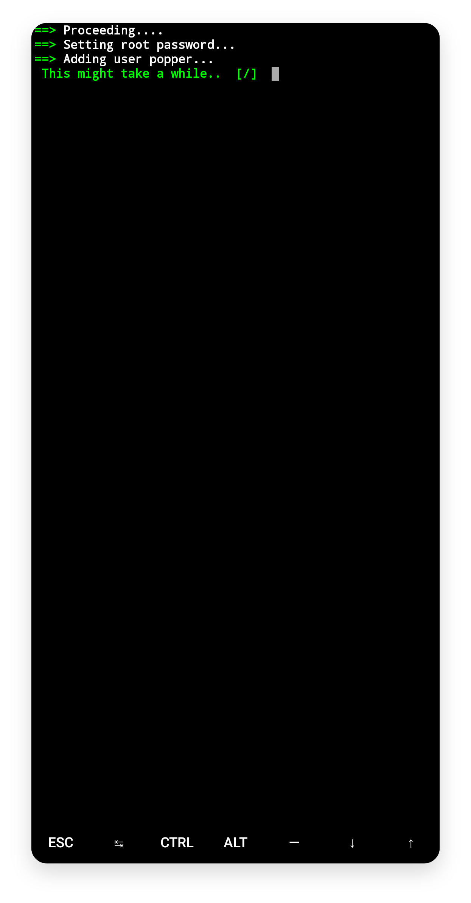

# Manjaro XFCE

Manjaro is one one of the Linux distro with bleeding edge features and has ocean of packages. Manjaro is good to go if you want performace, looks and the bleeding edge packages.

## Pre-requisites

* You need to login into Andronix either with your Google account or email \(register if you already have an account\). Worried about your privacy? Read more [here](https://andronix.app/privacy-policy/).
* After logging in, click on the Install button of your favourite distro.


**Confused** about which distribution to choose? here is a guide to help you out - _Modded OS Guide_


* If you haven't already purchased the distro, the app will prompt you to buy it first. You can proceed to the next step, if you already own the distro you want to install, else you can proceed to buy it.


Modded OS are a **life-time purchases** and can be used on any number of devices.


_If already bought, the app will generate a one-time code for you to download the OS._

## Installation

* That's it, let's proceed to the actual installation now. Click on the **Copy** button and paste the copied code in a **Termux shell**.
* Let it finish. The installation will take some time as these are much bigger than the normal \(un-modded OS\) because these have things pre-installed.


If the **download is slow** for you, please try to download using a **VPN** in the European Union.


* When the download and extraction will finish, your termux will look something like this-



* You now need to start the distro with the following command

```text
./start-androjaro.sh
```


* This will start the post-installation process i.e. setting up the essential packages. You will need to wait until this finishes.
* If the post-installation setup successfully executed, you will see a **blue screen** asking for a _username._ You can choose any username unless that's a reserved keyword like _admin, root etc._ \(your name works fine\). Press **Enter** to proceed.


If you can't access your keyboard for entering the username, press the **ESC** key at the bottom. This restarts the script and this time make sure that you have your keyboard out \(click anywhere on the terminal\) when you're in the Termux shell.




* The second thing the script asks for is your name. This can be anything to like. Again press **Enter** to proceed.


While selecting your username make sure that you dont enter any Linux reserved usernames such as **root, admin, etc.**  Also try to avoid the use of special characters in the username. If you break any rule for naming a user according to Linux, you might end up in an infinite process at the end of the installer. 



* Next you need a **Password**. You can choose any password as long as it is longer than 6 characters. Press **Enter** to proceed. Confirm the password by re-entering it and press enter to continue.



* Now you need a **Root Password.** You can choose any password as long as it is longer than 6 characters. Press **Enter** to proceed. Confirm the root password by re-entering it and press enter to continue.
* The next screen will show all the information entered. Check if those are the correct passwords and username \(if not, press _esc or back button_ to restart the script\). Press **Enter** to proceed.



* Now, wait until the system is creating the user. You should see something like this while the system is setting-up the user.



* That's it! After this finishes, you will see-

```bash
{your_username}@localhost:~$
```


* You can now continue to start the VNC server with the guide here to use the GUI.

