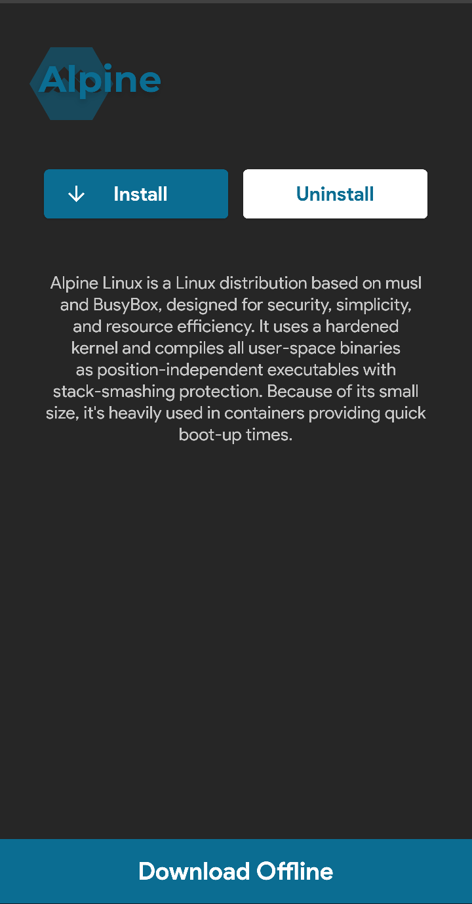
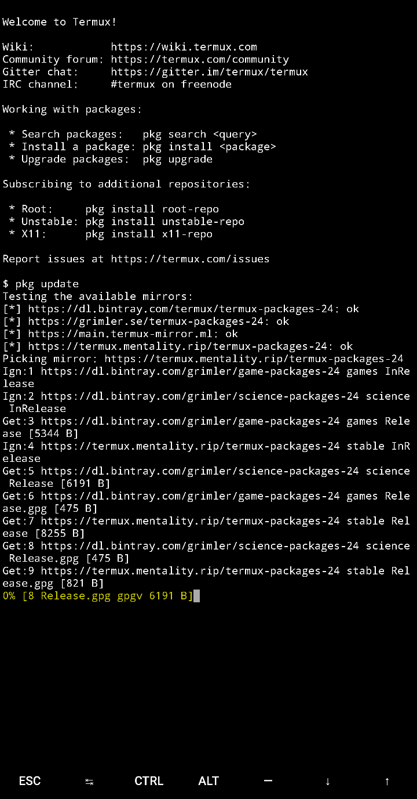

# Alpine


## Essential Information

Alpine provided by Andronix is open source including all the scripts needed for installing it. You can take a look at it [here](https://github.com/AndronixApp/AndronixOrigin).

**Download size** - 45 MB


The size mentioned above is not the size after installing Alpine but it's just the tar size that Andronix downloads. **This doesn't include a desktop environment for the GUI**.


## How to Install?

* Open the[ Andronix App](https://andronix.app/) and click on the Alpine card.
* Click the **Install** button.



* Tap "**Copy**" button and then tap "**Termux**" to go the Termux app.


* Use the command below to update your termux packages so that you're running the updated versions of the required packages.

```text
pkg update
```



* Tap & hold anywhere on the screen and press **Paste**.
* Press **Enter** and wait till the installation completes. 
* Type the following command to start the distro ****and press enter.

```text
./start-alpine.sh
```

* Now if you see `root@localhost` in Termux then you have successfully started Alpine.


This only includes the bare-bone Alpine system that can be used through a CLI \(Command Line Interface\). To install a **desktop environment** follow the guide here.



