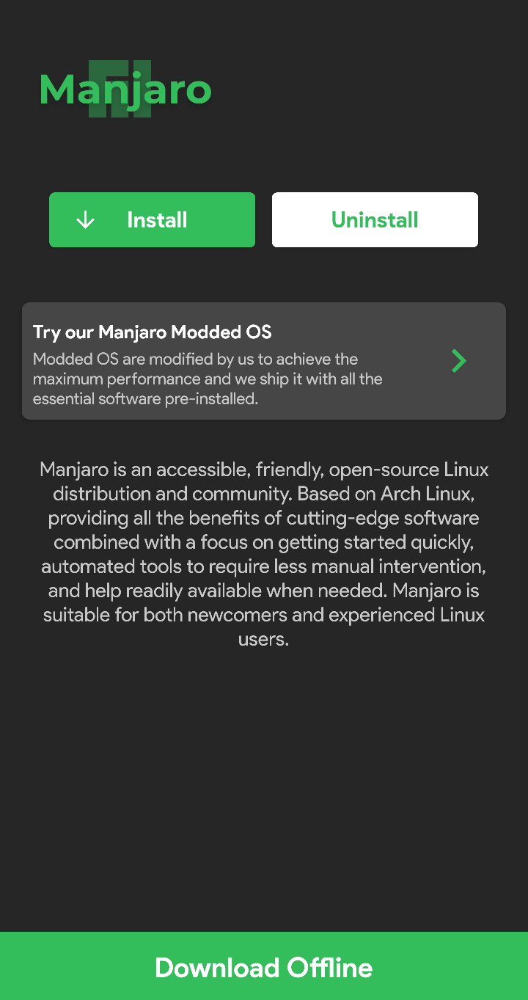

# Manjaro


Manjaro is only recommended for users with some experience of any Arch based distributions.



## Essential Information

Manjaro provided by Andronix is open source including all the scripts needed for installing it. You can take a look at it [here](https://github.com/AndronixApp/AndronixOrigin).

**Download size** - 45 MB


The size mentioned above is not the size after installing Manjaro but it's just the tar size that Andronix downloads. **This doesn't include a desktop environment for the GUI**.


## How to Install?

* Open the[ Andronix App](https://andronix.app/) and click on the Manjaro card.
* Click the **Install** button.



* The first three options will install Ubuntu 19 with the mentioned [Desktop Environment](https://en.wikipedia.org/wiki/Desktop_environment). The last **Non-DE** variant installs Manjaro without any Desktop Environment and is recommended for using the distro only with a _Command Line Interface_.


We recommend to choose **XFCE variant** as it is the most stable, smooth, advanced and customizable Desktop Environment present at the moment



* Use the command below to update your termux packages so that you're running the updated versions of the required packages.

```text
pkg update
```


* Tap & hold anywhere on the screen and press **Paste**.
* Press **Enter** and wait till the installation completes. 
* Type the following command to start the distro ****and press enter.

```text
./start-manjaro.sh
```

* Now if you see `root@localhost` in Termux then you have successfully started Manjaro.


This only includes the bare-bone Manjaro system that can be used through a CLI \(Command Line Interface\). To install a **desktop environment** follow the guide here.


